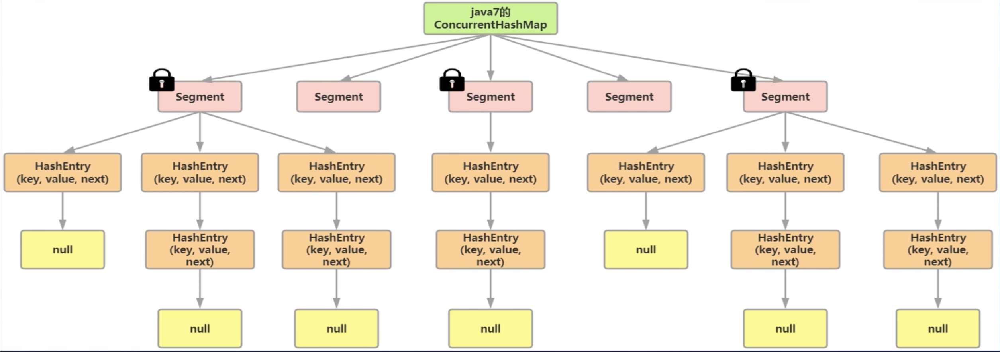
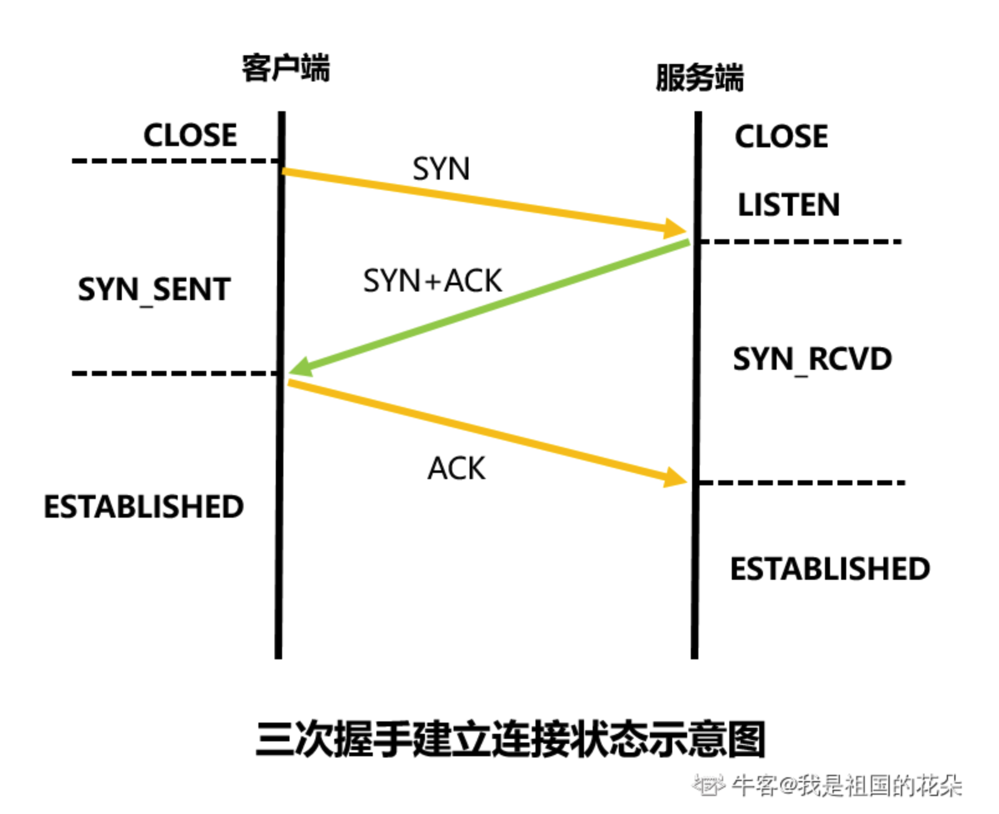
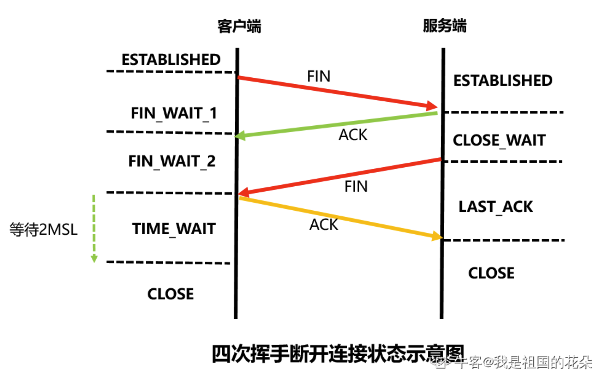
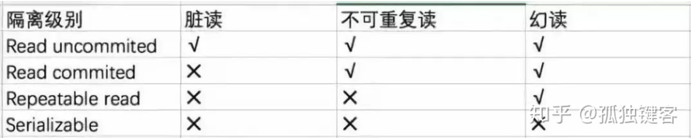

# 面向对象可以解释一下吗？

主要就是封装、继承和多态
## 封装
封装主要目的是增加程序的可读性，解耦合并且隐藏部分实现细节。
如何实现？将类重的属性私有化，然后通过公共的get/set方法进行访问，在get/set方法中可以对内部逻辑进行封装处理，外部的调用方不必关心我们的处理逻辑。
## 继承
Java中不支持多继承，一个类只可以有一个父类存在  
如果构造函数被private修饰，那么此类是不可以被其他类继承的。  
Java中类的初始化顺序：  
+ 初始化父类中的静态成员变量和静态代码块
+ 初始化子类中的静态成员变量和静态代码块
+ 初始化父类中的普通成员变量和代码块，执行父类的构造方法
+ 初始化子类中的普通成员变量和代码块，执行父类的构造方法  
### 覆盖 @Override
覆盖也叫重写，是指子类和父类之间方法的一种关系，即子类中的方法和父类中继承的方法有完全相同的返回值类型、方法名、参数类型以及参数个数
### 重载
是指在一个类中（包括父类）存在多个同名的不同方法，具体判断标准：参数的类型、数量、顺序  
> 如果是方法返回值类型不同，不能构成重载
# JDK, JRE 和 JVM 的区别和联系有哪些？
JDK，是一个开发工具包，提供编译、调试和运行一个Java程序所需要的所有工具，可执行文件和二进制文件
JRE，指Java运行时环境，是JVM的实现，是一个运行Java程序的平台，JRE包含了JVM，但不包含JDK
JVM，即Java虚拟机，当我们运行一个Java程序时，JVM负责将字节码转化为机器码，JVM提供了内存管理和垃圾回收等机制

# 为什么 Java 能一次编译，多处执行？
因为当我们用JDK时会将.java文件编译生成一个.class字节码文件，当我们运行这个文件的时候，JVM会将.class文件解析成对应的机器码  
# 抽象类和接口有什么区别？
+ 抽象类中可以没有抽象方法，也可以抽象方法和非抽象方法并存
+ 接口中的方法在JDK1.8之前只能是抽象的，JDK8版本开始提供接口中方法的default实现
+ 抽象类和类一样是单继承的；接口可以实现多个父接口
+ 抽象类中可以存在普通的成员变量，接口中的变量必须是statick final类型的，必须被初始化，接口中只有常量没有变量
# 接口和抽象类怎么选择？
如果我们只需要抽象方法，不需要一些方法的具体实现或者变量的时候，我们可以使用接口，反之我们需要使用抽象类。
## 如果一个类继承了多个接口，而且多个接口都有相同的抽象方法，如何选择方法呢？
1. 重写多个接口中相同的默认方法
2. 在实现类中指定要使用哪个接口的默认方法
# Java 的反射机制
Java的反射机制有了解吗？  
反射机制是对于任意一个类，都能够知道这个类的所有属性和方法，对于任意一个对象，都能调用他的任意一个属性和方法。  
[反射Demo](https://blog.csdn.net/han_xiaoxue/article/details/79227680)
## 如何获取 Class 类？
1. 通过类名称.class获取Class类对象
2. 通过对象.getClass()方法获取Class类对象
3. 通过类名称加载类，Class.forName()，只要有类名久可以得到Class  
    [反射Demo](https://www.nowcoder.com/tutorial/10014/6a9e9be19dc44f9682d6c8d55ebff9f5)

# List、Set 和 Map 各有什么特点

List和Set都是Collection的子接口

# ArrayList 和 LinkedList 有什么区别

+ 底层来讲：ArrayList底层是**动态数组**，LinkedtList底层是**双向链表**
+ ArrayList的存取效率高，LinkedList的增删效率高
+ LinkedList可用作堆、栈、双端队列使用

# 说说 Java 中常见的集合

+ Map和Collection是所有集合的父接口
+ Map包括：HashMap、TreeMap、HashTable、LinkedHashMap、**ConcurrentHashMap**等
+ Set包括：HashSet、TreeSet、LinkedHashSet等
+ List包括：ArrayList、LinkedList、Stack、Vector等

# HashMap 和 HashTable 的区别

+ HashMap可以用null作为key
+ HashTable线程安全

## HashMap 是线程不安全的吧？你可以举一个例子吗？
+ HashMap线程不安全主要是考虑了**多线程环境下进行扩容**可能会出现HashMap死循环
+ Hashtable线程安全主要是由于其内部实现在put和remove等方法上使用synchronized进行了同步，所以对单个方法的使用是线程安全的，但是如果进行**复合操作**时，**线程安全性无法保证**，比如一个线程先进行get然后put更新的操作，但是如果在这两个操作之间，可能别的线程已经对这个key做了改动，所以接下来的put操作可能不符合预期。
## HashMap 底层实现有了解过吗？
底层是**数组➕链表**，JDK8及其之后的版本中使用了**数组➕链表➕红黑树**实现，解决了链表因为太长导致查询慢的问题(如果链表长度大于8会将链表转为红黑树)
## HashSet 底层是什么？
是一个HashMap
## HashMap 的初始容量，加载因子，扩容增量是多少？
初始容量事16，记载因子为0.75，扩容增量是原来的一倍，HashMap的容量为16，超过16*0.75 = 12之后会开始扩容，一次扩容之后容量变为32。
## HashMap 的存储和获取原理
首先是通过调用hashCode()方法找到对应的bucket位置，当两个key的hashCode相同时，会在每一个bucket后接上一个链表，并将新储存的键值放在表头
## 解决哈希冲突的方法
1. 拉链法
2. 开放地址法
  + 线性探查
  + 二次探查
  + 伪随机探测
3. 再哈希（当发生哈希冲突的时候，使用第二个，第三个，第四个哈希函数来计算地址）
4. 建立公共溢出区
## ConcurrentHashMap 和 Hashtable 的区别？
ConcurrentHashMap结合了HashMap和Hashtable的优势，HashMap没有考虑同步，Hashtable考虑了同步的问题，但是Hashtable在每次同步执行时都要锁住整个结构。
区别是什么？
CocurrentHashMap在进行get，put，remove的时候，只锁上当前需要用到的桶

# CocurrentHashMap 实现原理



使用了 CAS ➕ synchronized 

# TreeMap 有哪些特性？
TreeMap底层用红黑树实现，TreeMap中存储的键值对**按照键来排序**
+ 如果key存入的是字符串等类型，那么会按照字典默认顺序排序
+ 如果传入的是自定义引用类型，比如说User，那么该对象必须实现Comparable接口，并覆盖compareTo方法
# ArrayList 和 LinkedList 有什么区别？
+ ArrayList底层使用了**动态数组**
+ LinkedList底层使用了**双向链表**实现，可当作堆栈、队列、双端队列使用
+ ArrayList在**随机存取**方面效率高于LinkedList
+ LinkedList在**增删方面**效率高于ArrayList
+ ArrayList必须预留一定空间，如果空间不足，会进行扩容操作
+ LinkedList的开销是必须存储节点的信息以及节点的指针信息
# HashSet 和 TreeSet 和 LinkedHashSet 有哪些区别？
+ HashSet底层是**哈希表**
+ HashSet唯一性原理是，通过判断元素的hashCode值是否相同，如果相同，还会继续判断元素的equals方法，是否为True
+ TreeSet底层是**红黑树**
+ TreeSet判断唯一性原理是通过Comparable和Comparator实现
# LinkedHashMap 和 LinkedHashSet 有了解吗
+ LinkedHashMap的Entry继承于HashMap的Node，两个类都实现了Map.Entry<K,V>
+ LinkedHashMap底层是**数组➕链表➕红黑树**的同时，加了一个双向链表，保证了遍历顺序和插入顺序一致的问题
+ 通过Entry中的before和after属性实现了一个双向链表，记录了插入顺序
+ LinkedHashSet底层使用了LinkedHashMap实现
# 什么是 LRU 算法？如何用 LinkedHashMap 实现？
LRU(Least recently used)算法根据数据的历史访问记录来进行淘汰数据，算法赋予每一个页面一个访问字段，用来记录一个页面自上次被访问以来所经历的时间t，如果需要淘汰一个页面的时候，选择现有页面中t值最大的。  
只需要将构造方法的accessOrder传入true，并且重写removeElestEntry方法即可
# List 和 Set 区别？
+ List数据是有序的并且可重复
+ Set数据是无序的并且不可重复
# Iterator 和ListIterator 的区别是什么？
+ Iterator可以遍历list和set集合，ListIterator只能用来遍历list集合
+ Iterator只能前向遍历，ListIterator可以前向和后向遍历集合
+ ListIterator是实现了前者，并且增加了一些新功能
# 数组和集合之间的转换
数组 -> 集合  Arrays.asList()
集合 -> 数组 List.toArray()
# Collection 和 Collections 区别？
Collection是一个顶层集合接口，Collections是一个集合工具类，可以操作集合，比如排序，二分查找，拷贝集合
# 进程和线程的区别？
+ 进程是一个“执行中的程序”，是系统进行**资源分配和调度**的单位
+ 线程是进程的一个实体，一个进程拥有多个线程，线程之间**共享地址空间和其他资源**（所以通信和同步等操作，线程比进程更加容易）
+ 线程一般不拥有系统资源
+ 线程上下文的切换比进程上下文切换要快很多 
## 为什么线程上下文切换比进程上下文切换块？
+ 进程切换时，涉及到当前进程的CPU环境的保存和新被调度运行进程的CPU环境的设置
+ 线程切换时，仅需要保存和设置少量的寄存器内容，不涉及存储管理方面的操作
## 线程可以拥有独属于自己的资源吗？
可以的，通过ThreadLocal可以存储线程的特有对象，也就是当前线程的资源
# 进程之间常见的通信方式：
1. 管道模型（Linux的杠，一个进程的输入作为另一个进程的输入）
2. 消息队列模型（更多用在多线程的生产者消费者之中，有生产者进程，有消费者进程，生产者生产的数据放在消息队列中去，然后消费者从消息队列中拿）
3. 共享内存 + 信号模型（开辟一片连续的存储空间，让所有线程都能访问，可能会出现线程或者进程不安全，所以需要引入信号量，保证同一个资源在同一刻只能被一个进程访问）
4. 信号
5. 使用socket套接字实现（更多用于网络，实现了进程和进程间的传输）
# 多线程与单线程的关系
+ 多线程指的是，在一个进程中，并发执行了多个线程，每个线程都实现了不同功能
+ 在单核CPU中，将CPU分为很小的时间片，在一个时刻只能有一个线程在执行，是在微观上轮流占用CPU的机制，由于CPU的轮询速度很快，所以看起来像是“同时”在执行一样
+ 多线程会在不同的线程上进行轮流切换，会导致程序运行速度变慢
+ 多线程不会提高程序的执行速度，反而会降低速度，但是对用户来水，可以减少用户等待的时间，提高了资源利用的效率
+ 多线程并发编程也会带来数据安全的问题，线程之间的竞争也会导致线程死锁等活性故障，线程之间的切换会带来**额外的开销**
# 线程的状态有哪些？
+ NEW（线程已创建，但是还未调用start方法启动）
+ RUNNABLE（创建线程并启动之后会进入这个状态 1. 可能正在运行 2. 正在等待资源）
+ BLOCKED（当线程需要进入synchronized同步块或者同步方法的时候，需要申请一个监视锁而进行的等待，会使线程进入blocked状态）
+ WAITING（如果调用Object.wait(), Thread.join() 或者 LockSupport.park()的话，需要另一个线程执行其余的操作来将其唤醒）
+ TIMED_WAITING（和上一个类似，不过其等待时间是明确的）
+ TERMINATED（线程执行结束了，RUN方法执行结束表示线程处于消亡状态了）
# 多线程编程中常用的函数比较
## sleep 和 wait 的区别
+ sleep方法，是Thread类的静态方法，当前线程将睡眠n毫秒，线程进入阻塞状态。当睡眠时间到了，会解除阻塞，进入可执行状态，等待CPU到来，睡眠不释放锁
+ wait方法，是Object的方法，必须与synchronized关键字一起使用，当notify或notifyall被调用之后，会解除阻塞，但是，只有重新占用互斥锁之后才会进入可运行状态，睡眠时会释放锁
+  join方法，当前线程调用，其他线程全部停止，等待当前线程执行完毕，接着执行
+  yield方法，该方法使当前线程放弃分得的CPU时间，但是线程不阻塞，还处于可运行状态，随时可能再次分得CPU时间
# 线程活性故障是什么？有哪些？
由于资源的稀缺性或者程序自身的问题导致程序**一直处于非Runnable状态**，并且其处理的任务**一直无法完成的现象**被称为线程活性故障，
## 线程死锁
死锁的起因是多个线程之间相互等待对方而被永远暂停
死锁的产生必须满足如下四个必要条件：
1. 资源互斥（一个资源每次只能被一个线程使用）
2. 请求与保持条件（一个线程因请求资源而阻塞时，对已获得的资源保持不放）
3. 不剥夺条件（线程获得的资源，在未使用完之前，不能强行剥夺）
4. 循环等待条件（若干线程之间形成一种头尾相接的循环等待资源关系）
## 如何避免死锁的发生？
+ 粗锁法：使用一个粒度粗的方法来消除请求与保持条件，缺点是会明显减低程序的并发性并且会导致资源的浪费
+ 锁排序法（比如某个线程只有获得A锁和B锁，才能对某资源进行操作，我们可以规定只有获得A锁的线程才有资格获得B锁，按顺序获取锁就可以避免死锁）
# 线程锁死是什么？
线程锁死时指等待的线程由于唤醒所需的条件永远无法成立，或者其他线程无法唤醒这个线程而一直处于非运行状态，和死锁的区别是，发生锁死时，产生死锁的四个必要条件都没发生，线程锁死仍然可能发生。
# 活锁是什么？
当一个程序一直处于运行状态，但是其所执行的任务却没有任何进展成为活锁，比如一个进程一直在申请所需要的资源，但是却无法申请成功。
# 线程饥饿是什么？
线程饥饿时指程序一直无法获得所需的资源导致任务一直无法运行的情况，线程调度模式分为公平调度和非公平调度，在非公平调度模式下，就可能会出现线程饥饿的情况
# 线程活性故障总结：
+ 线程饥饿发生时，如果线程处于可运行状态，那么会变为活锁
+ 只要一个或多个进程因为获取不到其所需的资源而无法进展，那么就是线程饥饿，死锁也算线程饥饿
# 如何实现并发编程？
继承Thread类或者实现Runnable接口
[多线程Demo](https://www.nowcoder.com/tutorial/10014/33a16fb2fc6745dbbacf4f6b655fde25)

# 多线程环境下的线程安全
多线程环境下的线程安全主要体现在原子性、可见性和有序性方面
## 1. 原子性
如何保证原子性？
+ 利用锁的排他性
+ 利用CAS
+ 在Java中，保证了除long和double型之外的任何变量的写操作都是原子操作
+ 在Java中，关键字修饰的变量可以保证写操作的原子性
### 悲观锁
操作系统认为，如果不严格同步线程调用，那么一定会产生异常。
（互斥锁是悲观锁）
如果同步代码块执行的耗时远远小于线程切换的耗时，悲观锁效率不高。 

### 乐观锁
当线程需要修改共享资源的对象时，总是会乐观的认为，对象状态值没有被其他线程修改过，每次自己都会去主动Compare状态值。实际上没有用到锁，只是一种无锁的同步机制
### 什么是 CAS
全称Compare and Swap，也就是比较和交换
主要涉及到三个值，当前内存值，预期内存值和更新内存值，只有当前值和预期值相等时，才将内存值更新为更新值，成功返回true否则返回false。
Compare 和 Swap必须具有原子性

#### CAS 有什么使用场景呢？
CAS主要使用在一些需要上锁的场景充当乐观锁的解决方案，一般一些简单且要上锁的操作但又不想引入锁的场景下，可以使用CAS代替锁。一般来说CAS适合读多写少的场景
#### CAS 有什么缺点吗？
1. ABA问题 
   ABA问题指，又一个线程t1在进行CAS操作时，其他线程t2将变量由A变成了B，然后又将其改为了A，这时候t1发现A并没有改变，因此进行了交换。
   解决方案：
   + 在对变量进行操作的时候给变量加一个版本号，每次对变量操作都将版本号+1
   + Java提供了相应的原子引用类，对对象标记版本戳
2. 自旋带来的消耗 
   解决方案：
   + 设置合适的自旋次数
   + 使用JVM能支持处理器提供的pause指令来提升效率  
3. CAS只能单变量
对于一个共享变量，可以使用CAS来保证原子操作，但是当有多个共享变量时，那就无法用CAS保证原子性，JDK1.5之后，提供了AtomaticReference类来保证引用对象的原子性，可以把多个变量放在一个对象里操作。
## 2. 可见性
可见性是指一个线程对于共享变量的更新，对于后续访问该变量的线程是否可见的问题。
现代计算机中，处理器的速度远大于内存的速度，所以在主内存和处理器之间加入了**寄存器、高速缓存、写缓冲器以及无效化队列**等部件来加速内存的读写操作，这些部件被称为**处理器缓存**  
处理器对内存的读写操作，其实是与处理器缓存进行了交互，一个处理器缓存上的内容无法被另外一个处理器读取，所以另外一个处理器必须通过缓存一致性协议来读取其他处理器缓存中的数据，并同步到自己的缓存处理器中，这样保证了其余处理器的更新对于其他处理器是可见的。
### 单处理器中，为什么也会出现可见性问题呢？
因为在单处理器中，由于是多线程并发编程，所以会存在线程的上下文切换，线程会将对变量的更新当作上下文存储起来，导致其他线程无法看到这个变量的更新，所以会出现可见性问题。  
### 可见性如何保证？
+ 当前处理器缓存需要刷新处理器缓存，使得其余处理器对变量所做的更新可以同步到当前处理器缓存中。
+ 当前处理器对共享变量更新之后，需要冲刷处理器缓存，使得该更新可以被写入处理器缓存中。
## 3. 有序性
有序性是指一个处理器上运行的线程所执行的内存访问操作在另一个处理器上运行的线程来看是否有序的问题
### 重排序
为了提高程序执行的性能，Java编译器在其认为不影响程序正确性的前提下，可能会对源代码顺序进行一定的调整，导致程序运行顺序与源代码顺序不一致
### 重排序举例
Instance instance = new Instance(); 发生了啥？
+ 在堆内存上分配对象的存储空间
+ 在堆内存上初始化对象
+ 设置instance指向刚分配的内存地址
第二步和第三步可能会发生重排序，导致引用型变量指向了一个不为null但是也不完整的对象，（在多线程下的单例模式中，这时候就需要使用volatile来禁止重排序）
# 谈谈你对 synchronized 关键字的理解
synchronized是Java中的一个关键字，是一个内部锁。可以用在方法和方法块上，表示同步方法和同步方法块。在多线程环境下，同步方法或者同步方法块在同一时刻只允许有一个线程在执行，其余线程都在等待锁，也就是实现了整体并发中的局部串行。  
首先，Entry Set中聚集了一些要进入monitor的线程，都处于waiting状态，如果此时有一个线程A进入了monitor，此时A处于active状态，如果此时A遇到了判断条件需要暂时让出执行权，那么他将进入wait set的同时被标记为waiting。此时其他线程就有机会进入monitor，如果此时有个线程B进入了monitor并完成了任务，可以通过notify唤醒waiting set中的A
## synchronized 消耗
synchronized依赖monitor实现（monitor是一种同步工具，通常被描述为一个对象），依赖操作系统的mutex lock实现的，Java多线程是对操作系统的映射，每次挂起和唤醒都要切换操作系统的内核态，这种操作是重量级的，某些情况下切换任务花的时间可能会超过线程执行任务的时间，会对程序的性能产生影响  
内部锁底层实现：
+ 进入时，执行monitorenter，将计数器+1，释放锁时执行monitorexit，计数器-1
+ 当一个线程判断到计数器为0时，则当前锁空闲，反之当前线程进入等待状态  
[锁资料](https://www.bilibili.com/video/BV1xT4y1A7kA?spm_id_from=333.999.0.0)
## 锁的四种状态（对应 mark word 中的四种状态）：
1. 无锁
2. 偏向锁
3. 轻量级锁
4. 重量级锁
锁只能升级，不能降级  
## 四种锁状态分析
### 1. 无锁
+ 无竞争
  + 某个对象不会出现在多线程环境下，或者即使出现在多线程环境下也
+ 存在竞争，不锁定资源
  + 还是想通过一些机制来控制多线程，比如说有多个线程都想修改同一个值，但是我们不通过锁定资源的方式，而是通过一定机制锁定只有一个线程能修改成功，而其他修改失败的线程将会不断尝（CAS）
### 2. 偏向锁
+ 如果实际运行中只有一个线程会获取锁，最理想的状态就是： 1. 不通过线程状态切换(mutex lock) 2. CAS， 因为这些多多少少会消耗资源，最理想的方式对象能认识这个线程
#### 偏向锁、轻量级锁、重量级锁切换原理
mark word中（倒数3个bit分别为 是否为偏向锁，锁标志位），当锁标志位是**01**时，判断倒数第三个bit是否为1，如果为1，代表当前锁状态为偏向锁，否则为无锁。如果读取到偏向锁，那么就去读mark word的前23个bit，这23个bit就是线程ID，通过线程ID来判断当前想要获得对象锁的线程是不是老顾客，如果是老顾客直接调用资源。如果不是老顾客，说明当前有多个对象正在竞争锁，此时偏向锁会升级为轻量级锁。
一旦升级成功，那么将**不再使用线程ID（前23个字段）**这个字段，而是将**前30个字段**变为了指向**线程栈中的锁记录的指针**
当一个线程想要获得某个对象的锁时，加入看到标志位为00，那么就知道是轻量级锁，然后会在虚拟机栈（线程私有的）中开辟一块被称为lock record的空间，lock record中存放的是对象头中mark word的副本和owner指针。线程通过CAS去尝试获取锁，一旦获得，那么将会复制该对象头中的mark word到lock record中，并且将lock record中的owner指针指向该对象，另一方面，该对象中的mark word的前30个bit将会生成一个指针，指向线程虚拟机栈中的lock record，这样就实现了线程和对象锁的绑定，这时这个对象就被锁定了，此时获取了这个对象的线程就可以去执行一些任务。
此时如果有其他线程也想获取这个对象，会发生什么呢？
会自旋等待，线程自己在不断循环，尝试着目标对象的锁有没有被释放，如果释放了就获取，如果没有释放就继续循环。这种操作区别于被操作系统挂起，因为如果对象的锁很快就会被释放的话，自旋就不需要系统中断和系统恢复，效率更高。如果长时间自旋，会浪费CPU资源。

#### 适应性自旋
自旋时间不固定了，而是由：1. 上一次在同一个锁上的自旋时间 2. 锁状态两个条件决定
比如说，在同一个锁上，当前正在自旋等待的线程刚刚已经成功获取过锁，但是锁是被其他线程占用，那么虚拟机就会认为这次自旋很有可能也会再次成功，进而允许更长的自旋时间。
如果此时，有另一个线程也在自旋时间，此时轻量级锁会升级为重量级锁。
如果被标记为重量级锁，会使用monitor来控制资源，此时资源会被完全锁定，对线程的管控也会最为严格  
01代表无锁/偏向锁，00代表轻量级锁，10代表重量级锁  

## synchronized 能保证原子性、可见性、有序性：
锁通过互斥来保障原子性，临界代码区同时只能被一个线程执行，保障了原子性 
synchronized内部锁通过刷新处理器缓存和冲刷处理器缓存保证可见性。

+ 获得锁之后，需要**刷新处理器缓存**，使得前面写线程所做的更新可以同步到本线程  
+ 释放锁需要**冲刷处理器缓存**，使得当前线程对共享数据的改变可以被同步到下一个处理器缓存中去
对有序性保障，因为能保障原子性、可见性，所以使得线程在临界区中执行的一系列操作**看起来是完全按照源代码顺序执行**的。
JVM对资源的调度方式：
1. 公平调度方式
   + 按照申请的先后顺序授予资源的独占权  
2. 非公平调度方式
   +在该策略中，当自愿的持有线程释放资源的时候，等待队列中的一个线程会被唤醒，而该线程从被唤醒到执行还需要一一段时间。在该段时间内，新来的线程（活跃线程）可以先被赋予该自愿的独占权  
   不同调度方式优缺点分析：
   非公平策略：
+ 优点：吞吐率高，单位时间内可以为更多的申请者分配资源
+ 缺点：资源申请者申请资源所需的时间偏差可能较大，并可能出现线程饥饿
公平策略：
+ 优点：线程申请资源所需的时间偏差较小，不会出现线程饥饿的现象，适合在平均申请资源时间较长的情况下使用
+ 缺点：吞吐量较小 
JVM对synchronized内部锁的调度是非公平调度
# 谈谈对 volatile 的理解
volatile是Java虚拟机提供的最轻量级的同步机制，是一个轻量级锁
+ volatile可以保证主内存和工作内存直接产生交互
+ volatile仅能保证写操作的原子性
+ voaltile可以禁止重排序
## volatile 的开销
使用volatile不会导致上下文切换，但是其读取变量的成本变高，因为其每次都需要从高速缓存或者主内存中读取，无法直接从寄存器中读取

## volatile 在什么情况下可以代替锁
volatile是一个轻量级锁，它适合多个线程共享共享一个状态变量，锁适合多个线程共享一组状态变量。
如果想要用volatile代替锁，可以将多个线程共享的一组状态变量合并成一个对象，用一个volatile来引用该对象，从而替代锁。

# 锁机制
每个Object都拥有一把锁，锁存放在对象头中，锁记录了当前对象被哪个线程占用。  
## 对象结构分析
对象头、实例数据、填充字节（为了保证对象大小是八字节的整数倍）
### 对象头包含：
1. mark word（存储当前对象运行时状态有关的数据）
对象中的锁信息存放在mark word中
2. class pointer（当前对象类型所在方法区中的类型数据）

# AQS(AbstractQueuedSynchronizer)
线程获取锁的两种模式：
+ 独占：一旦被占用，其他线程都不能占用
+ 共享：一旦被占用，其他共享模式下的线程能占用
  AQS成员属性：
+ int state
  在共享模式下，其他以共享模式获取锁的线程也能获取锁，所以需要把state设置成int型来表示线程占用的数量
+ Node head
+ Node tail
  如果一个线程没有获取到资源，需要排队，这个队列是FIFO双线链表，代表头和尾。

源码：

```java
protected boolean tryAcquire(int arg){
  throw new UnsupportedOperationException();
}
// 实现是抛出一个异常
```

AQS要求继承类必须override这个方法，否则就直接抛出不支持该操作的异常。

重写之后，如果上层不想等待锁，那么就可以直接处理，如果需要等待锁，那么就调用acquire()方法，不用自己处理。

# 浏览器输入 URL 回车之后发生了什么

1. DNS（Domain Name System）解析（将域名转成IP地址）
2. 建立TCP连接（三次握手）
3. 发送HTTP请求
4. 服务器收到响应HTTP请求
5. 页面渲染（解析HTML、CSS和JSP文件）

# HTTP 请求报文/响应报文

+ 请求行
+ 请求头部
+ 空行
+ 请求数据

---

+ 状态行
+ 响应头部
+ 空行
+ 响应数据

# TCP 拥塞控制

[TCP拥塞控制资料](https://www.bilibili.com/video/BV1L4411a7RN?from=search&seid=17298520952506489388&spm_id_from=333.337.0.0)

假定条件：

1. 数据是单向传送由发送方发送TCP数据报文段到接收方，接收方只发送TCP确认报文段
2. 接收方总是由足够大的缓存空间，因此发送方发送窗口的大小由网络的拥塞程度来决定
3. 以TCP报文段的个数为讨论单位，而不是以字节为单位

发送方维护一个叫做**拥塞窗口cwnd**的状态变量，其值取决于网络的拥塞程度，并且动态变化

+ 拥塞窗口**cwnd的维护原则**：只要网络没有出现拥塞，拥塞窗口就再增大一些；只要网络一出现拥塞，拥塞窗口就减小一些
+ 判断出现**网络拥塞的依据**：没有按时收到应当到达的确认报文（即发生了重传）

维护一个**慢开始门限ssthresh**状态变量：

+ cwnd < ssthresh时，慢开始算法；
+ cwnd == ssthresh时，慢开始或者拥塞避免算法
+ cwnd > ssthresh时，拥塞避免

## 慢开始（slow-start）

最开始的时候cwnd为1，然后每次成功传输之后都翻倍，直到达到ssthresh的值


## 拥塞避免（congestion avoidance）

当cwnd == ssthresh时，cwnd每次都+1，直到发生拥塞（发生拥塞的判断机制是，发送方没有收到正常数量的确认报文段），之后将ssthresh设置为原来的一半，cwnd设置为1，重新进入到慢开始算法

> 有时，个别报文段会在**网络中丢失**，但实际未发生拥塞
>
> + 这将导致发送方超时重传，并误认为发生了拥塞
> + 此时发送方会错误启动慢开始算法，并发cwnd又设置为1，因此降低了传送效率

## 快重传（fast retransmit）

使发送方尽快进行重传，而不是等**超时计时器**超时再重传

+ 要求接收方不要等待自己发送数据时才捎带进行确认，而是要立即发送确认
+ 即使收到了失序的报文段也要立即发出对已收到报文段的**重复确认**
+ 发送方一旦收到**三个连续的重复确认**，就讲相应的报文段**立即重传**，而不是等超时计时器超时再重传

## 快恢复（fast recovery）

发送方一旦收到三个重复确认，就知道现在只是丢失了个别报文段，于是不启动慢开始算法，而是**执行快恢复算法**

+ **发送方将慢开始门限ssthresh值和拥塞窗口cwnd值调整为当前窗口的一半；开始执行拥塞避免算法**
+ 也有的快恢复算法是把快恢复开始时的cwnd值调整为ssthresh+3

# 什么是线程池？为什么要使用它？

[线程资料](https://mp.weixin.qq.com/s/HWoyHgZiUz7pqFhYxfLDNA)

创建线程要话费昂贵的资源和时间，如果任务来了才创建线程那么响应时间会变长，而且一个线程能创建的线程数有限，为了避免这些问题，在程序启动的时候就创建若干线程来相应处理，他们被称为线程池，里面的线程叫做工作线程。

好处如下：

1. 降低资源消耗，避免了反复创建线程
2. 提高响应速度，当任务到达时，任务不需要等待线程创建就可以直接执行
3. 提高线程的可管理性，通过线程池可以统一管理

## 为什么要控制线程数？

在JVM中每创建一个线程就需要调用操作系统提供的API创建线程，并赋予资源，并且销毁线程同样也需要系统调用，而系统调用就意味着上下文切换等开销，并且线程也是需要占用内存的，而内存是宝贵的资源。

# 线程池的排队策略

+ 如果运行的线程少于corePoolSize，则Executor始终首选添加新的线程，而不进行排队
+ 如果运行的线程等于或者多余corePoolSize，则Executor始终首选将请求加入队列，而不是添加新线程
+ 如果无法将请求加入队列，则队列已经满了，此时则创建新的线程，如果创建次线程超出maximumPoolSize，则拒绝此任务

# 设计模式

## 单例模式

定义一个类只能有一个实例存在

### 应用场景

比如在某个服务器中，该服务器的配置信息存放在一个文件中，这些配置数据由一个单例对象读取，服务进程中的其他对象可以直接通过这个单例对象获取这些配置信息。

### 步骤

+ 将构造方法定义为private方法，这样其他地方的代码就无法通过代码实例化该对象，只有通过该类提供的静态方法调用
+ 在类内部提供一个静态方法getInstance()，获取该对象

### 懒汉式（非线程安全）

```java
public class Singleton {  
    private static Singleton instance;  
    private Singleton (){}  
  
    public static Singleton getInstance() {  
    if (instance == null) {  
        instance = new Singleton();  
    }  
    return instance;  
    }  
}
```

### 懒汉式（线程安全）

```java
/**
 * 多线程环境下的懒汉式单例模式(DCL，双检锁+volatile实现)
 * 加入了volatile变量来禁止指令重排序  
 * @author ywq
*/
class Single{ 
    private static volatile Single s = null; 
    private Single(){} 
 
    public static  Single getInstance(){
        if(null==s){
            synchronized(Single.class){
                if(null==s) 
                    s = new Single(); 
            }
        }
        return s; 
    } 
}
```

### 饿汉式

```java
public class Singleton {  
    private static Singleton instance = new Singleton();  
    private Singleton (){}  
    public static Singleton getInstance() {  
    return instance;  
    }  
}
```

## 工厂模式

[工厂模式资料](https://www.bilibili.com/video/BV1CF411h7ES?from=search&seid=4483846560152526447&spm_id_from=333.337.0.0)

### 简单工厂模式

缺点：

1. 使用简单工厂模式会增加系统中类的个数，一定程度上增加了系统的复杂程度和理解难度
2. 系统拓展困难，一旦添加产品就不得不修改工厂逻辑，在产品类型较多的时候有可能造成工厂逻辑复杂
3. 违背了开闭原则（对拓展开放，对修改关闭）

#### 一个虚拟接口

```java
public interface Car {
     public void createCar();
}
```

#### 一个工厂类

```java
public class FactoryCar {
    public void productCar(String type){
        if(type.equals("Benz")){
            Benz benz = new Benz();
            benz.createCar();;
        }
        else{
            BWM bwm = new BWM();
            bwm.createCar();
        }
    }
}
```

#### 几个具体实现类

```java
public class Benz implements Car{
    @Override
    public void createCar() {
        System.out.println("生产奔驰");
    }
}
// ------------------------------------------------------------
public class BWM implements Car {

    @Override
    public void createCar() {
        System.out.println("生产宝马");
    }
}
```

#### 主函数

```java
public class Main{

    public static void main(String[] args) throws Exception
    {
        FactoryCar factoryCar = new FactoryCar();
        factoryCar.productCar("Benz");
        factoryCar.productCar("BWM");
    }
}
```

### 工厂方法模式

好处在于，如果需要添加产品，只需要做如下操作：

1. 具体工厂类实现抽象工厂接口
2. 具体产品类继承具体工厂类，并实现抽象产品接口

#### 两个虚拟接口（虚拟对象和虚拟工厂）

```java
public interface Car {
    void prection();
}
// ------------------------------------------------------------
public interface CarFactory {
    void carFactory();
    void productCar();
}
```

#### 几个具体的工厂类

```java
public class FactoryBaoma implements CarFactory {
    @Override
    public void carFactory() {
        System.out.println("这是宝马汽车工厂");
    }

    @Override
    public void productCar() {
        System.out.println("宝马工厂正在生产宝马汽车");
    }
}
// ------------------------------------------------------------

public class FactoryBenchi implements CarFactory {
    @Override
    public void carFactory() {
        System.out.println("这是奔驰汽车工厂");
    }

    @Override
    public void productCar() {
        System.out.println("奔驰工厂正在生产奔驰汽车");
    }
}

```

#### 几个具体的被生产对象

```java
public class BaoMa extends FactoryBaoma implements Car{

    @Override
    public void prection() {
        System.out.println("这是奔驰汽车");
    }
}
// ------------------------------------------------------------
public class BenChi extends FactoryBaoma implements Car{
    @Override
    public void prection() {
        System.out.println("这是宝马汽车");
    }
}

```

#### 主函数

```java
public class Main{

    public static void main(String[] args) throws Exception
    {
        BenChi bc = new BenChi();
        bc.prection();
        bc.carFactory();
        bc.productCar();
    }
}
```

# OSI 七层模型

+ 应用层：由用户自己规定，规定各个应用之间消息传递的形式等，常见的协议有HTTP协议和FTP等
+ 表示层：在满足满足用户需求的基础上，尽可能节省传输费用而设置的，主要对传输数据进行编码。比如用jpeg编码图片，用mp3编码声音等
+ 会话层：用于建立和拆除对话
+ 传输层：负责将来自会话层的消息传递给网络层，常见的协议有TCP和UDP等
+ 网络层：规定通信网内的路由选择等方式
+ 数据链路层：规定格式化数据如何传输
+ 物理层：定义网线的特性等

顺序是这样记得：首先是**应用层**，应用层是最上层的，然后是定义**表示层**，规定数据怎么传输，然后是**会话层**连接，连接之后，通过**传输层**传输数据，再之后通过**网络层**定义路由选择方式，然后通过**数据链路层**定义格式化数据如何传输，最后是**物理层**定义网络硬件的基本构成。

# TCP/IP 协议有了解吗

TCP/IP协议是一系列网络协议的总称，是网络通信的基本骨架。是OSI七层模型的简化版

+ 应用层（应用层、表示层、会话层）：HTTP、FTP、SMTP、DNS协议等
+ 传输层（传输层）：TCP协议、UDP协议
+ 网络层（网络层）：IP协议、ARP协议（用来获取MAC地址）
+ 数据接口层（数据链路层、物理层）

# 说一下三次握手和四次挥手

## 三次握手介绍




客户端状态变化：

CLOSE -> SYN_SENT -> ESTABLISHED

服务端状态变化：

CLOSE -> LISTEN -> SYN_RCVD -> ESTABLISHED

## 两次握手可以吗

不可以！如果只有两次握手，那么当服务端收到SYN之后，发送出SYN➕ACK后就会处于工作状态，此时的风险是来自客户端的SYN包可能是很久之前发出的，客户端在收到SYN➕ACK时会丢弃，但此时服务器已经进入了工作状态，会造成资源的浪费。

## 四次挥手



客户端状态变化：

CLOSE -> FIN_WAIT 1 -> FIN_WAIT 2 -> TIME_WAIT -> CLOSE

服务端状态变化：

CLOSE -> **CLOSE_WAIT** -> **LAST_WAIT** -> CLOSE

## 为什么断开连接要四次

因为服务器响应断开请求的时候，ACK和FIN时分两次发送的，第一次是客户端想要断开连接，服务器先给出 ACK 确认信号，表示已经收到 FIN 请求，然后当自己也可以结束的时候再发送 FIN 信号。

## 四次挥手主动方为什么需要等待 2 MSL？

MSL指最大报文生存周期（Maximum Segment Lifetime），因为当客户端发送 ACK 之后，不确定服务器能不能收到 ACK，如果在 TIME_WAIT 时间内，又收到了 FIN 信号，说明服务器未收到 ACK，此时客户端会重传ACK。

# TCP 和 UDP 协议的区别

+ TCP协议进行连接前需要三次握手；UDP不需要建立连接就可发送
+ TCP有确认机制，可以保证数据的安全；UDP不保证安全，只是负责发送数据包
+ TCP会对大数据包进行拆分，并在接收方重组数据；UDP不进行分片和重组
+ TCP头部为20字节，UDP头部为8字节

## UDP协议的应用

DNS协议、视频或语音传输

# HTTP 和 HTTPS 介绍下

HTTPS = HTTP ➕ SSL

HTTP 是超文本传输协议（HyperText Transfer Protocol ），HTTP 是明文传输

HTTPS 是超文本传输安全协议（HyperText Transfer Prootcol Secure）

# HTTP 请求中 Get 和 Post 方法有什么区别

+ Get 一般用来从服务器中获取资源，Post 一般用来更新服务器上的资源
+ Get 请求有长度限制，Post没有
+ Get 速度更快，Post 速度慢

# 数据库调优

+ 通过慢查询优化有问题的 SQL 语句
+ 选择合适的索引
+ 数据表优化：1. 尽可能使用更小的数据类型 2. 使用简单的数据类型 3. 尽可能使用 not null
+ 硬件优化

# 什么是事务

事务：是数据库操作中的最小概念，是作为整个逻辑工作单元执行的一系列操作；特点是要么一起成功（事务提交），要么一起失败（事务回滚）


# 四大隔离级别

## 可能出现的三大问题

### 脏读

读取未提交的数据

事务A读取了事务B中尚未提交的数据。如果事务B回滚，则A使用了错误的数据。

### 不可重复读

读取了提交的新事物

对于数据库内的某个数据，一个事务范围内多次查询却返回了不同的数据值，这是由于在查询间隔，被另一个事务修改并提交了。

### 幻读：

一个事务的两次查询中的数据笔数不一致，假如有一个事务查询了几列数据，而另一个事务却在此时插入了新的几列数据，先前的事务在接下来的查询中，就有几列是未查询出来的，此时就会报错

## 事务丢失

### 第一类丢失（回滚丢失）

比如A和B同时在执行一个数据，A已经提交了，但是B回滚了，这样A事务的操作就丢失了

### 第二类丢失（提交覆盖丢失）

比如A和B一起执行一个数据，两者同时抓到一个数据，A先提交，然后B再提交，这样B就覆盖了A

## 四大隔离级别

## Read Uncommitted

一个事务可以读取到另一个未提交事务的数据，会产生脏读。

## Read Committed

一个事务要等待另一个事务提交之后才能读取数据，会产生不可重复读。

## Repeatable Read

重复读，就是在开始读取事务的时候，不再允许修改才做，可能产生幻读。

## Serializable

是最高的事务隔离级别，在该级别之下，事务串行顺序执行，可以避免脏读、不可重复读、幻读，但是这种隔离级别效率低下，比较消耗数据库性能，一般不用。



> 大多数数据库默认是Read Committed，比如 SQL Server, Oracle
>
> MySQL默认级别是Repeatable Read

# innoDB 介绍一下

innoDB是MySQL的数据库引擎之一，为MySQL的默认存储引擎，最大特色是支持ACID

## 什么是ACID

+ 原子性（Atomic）：事务中各项操作要么全做，要么不做，任何一项操作的失败都会导致整个事务的失败；
+ 一致性（Consistent）：事务结束后系统的状态是一致的；
+ 隔离性（Isolated）：并行执行的事务彼此是无法看到对方的中间状态；
+ 持久性（Durable）：事务完成后所做的改动都会被持久化，即使发生灾难性的失败，通过日志和同步备份可以在故障后重建数据；

# mysql 索引介绍一下

索引是帮助MySQL**高效获取数据**的**数据结构**，类似于一本书前面的目录。

底层是B+树

## 使用 B+ 树有什么好处？

- 数据量相同的情况下，B+树更矮胖，IO次数会减少
- B+树的查询必须最终找到叶子节点，而B树只需要找到匹配元素，B+树更稳定
- 范围查询中，B+树只需要在链表上做遍历即可，而B树只能靠中序遍历

>  [B+树资料] : https://zhuanlan.zhihu.com/p/54102723

## 最左匹配原则

如果有一个3列索引(col1,col2,col3)，实际上已经建立了三个联合索引(col1)、(col1,col2)、(col1,col2,col3)

如果不是按照这个规则来匹配那么就无法用到索引

# 主从复制

指定一个数据副本为主节点，当客户端写入数据时，必须将该请求发送至主节点，主节点会保存最新的数据，然后主角点再把对数据的更改发送到所有从节点
